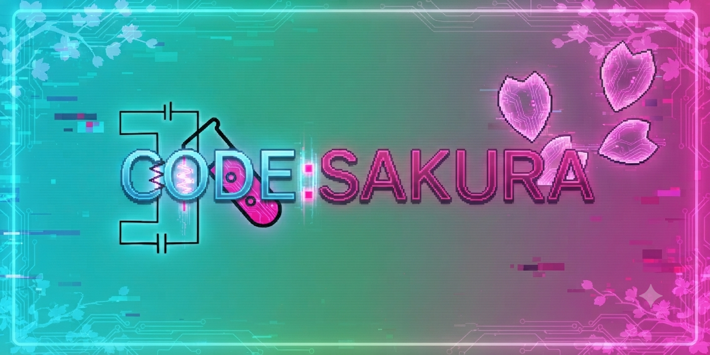
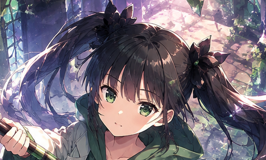

# 🌸 CODE: SAKURA

<p align="center">
  
</p>

<p align="center">
  <b>巴理恵と巴和葉を中心としたオリジナルシリーズ</b>
</p>

---

## 👭 Characters

<table>
<tr>
<td align="center" width="50%">

### 巴 理恵


**冷静沈着な天才研究者**

桜山市立高分子科学研究所の所長を務める少女。

合理的かつ論理的な性格だが、妹の和葉をとても大切にしている。

</td>

<td align="center" width="50%">

### 巴 和葉



**明るく元気な理恵の妹**

理恵のことを「お姉ちゃん」と呼ぶ。

行動力が高く、理恵とは正反対の性格をしている。

</td>
</tr>
</table>

---

## 🌸 About

**CODE: SAKURA** は、桜山市を舞台としたオリジナルシリーズです。

姉の**理恵**と妹の**和葉**を中心に、

- 日常
- コメディ
- 科学
- 冒険
- RPG
- シリアス
- クロスオーバー

など、さまざまなジャンルの物語を展開します。

---

## 🏙️ World

### 桜山市

CODE: SAKURAの主な舞台。

山・市街地・海岸など、さまざまな場所が存在します。

主なスポット：

- 🏠 巴家
- 🔬 桜山市立高分子科学研究所
- ⛩️ 桜山神社
- 🚉 桜山駅
- 🚉 桜山市街地駅
- 🚉 西桜山駅
- 🌊 桜海岸
- ⛰️ 桜山

---

## 🔬 桜山市立高分子科学研究所

理恵が所長を務める研究施設。

CODE: SAKURAの世界における重要な施設の一つです。

科学研究だけでなく、さまざまな出来事の舞台となります。

---

## 🏠 巴家

理恵と和葉が暮らしている家。

一見すると普通の家ですが、地下には研究設備などが存在します。

---

## 🎮 Game

CODE: SAKURAでは、将来的なゲーム化も想定した設定を制作しています。

### 想定ジャンル

**RPG / Adventure / Comedy**

ゲームシステム、キャラクターステータス、戦闘システムなどの設定も制作していきます。

---

## 📁 Repository

```text
CODE: SAKURA/
│
├── README.md
│
├── files/
│   └── assets/
│       ├── logo.png
│       ├── rie.png
│       └── kazuha.png
│
├── characters/
│   ├── rie.md
│   └── kazuha.md
│
├── world/
│   └── ...
│
└── stories/
    └── ...
```

---

## ✨ Concept

> **科学も、日常も、姉妹ならなんとかなる。**

冷静で合理的な理恵。

明るく行動力のある和葉。

正反対の二人だからこそ生まれる物語を描いていきます。

---

## 📌 Status

🚧 **In Development**

現在もキャラクター、世界観、ストーリー、ゲームシステムなどを制作中です。

設定は制作状況に応じて変更・追加される場合があります。

---

## 🌸 CODE: SAKURA

**Rie & Kazuha**

© ScapeTomoe